# WebServer
使用C++ 编写的全栈即时通讯项目，前端基于QT实现仿微信布局，后端采用分布式设计，分为GateServer 网关服务，多个ChatServer聊天服务，StatusServer 状态服务以及 VerifyServer验证服务。 支持添加好友、好友通信、聊天记录展示等功能。

## 用户登录注册界面

该界面支持密码隐藏和展示功能，同时可以跳转至注册界面以及修改密码界面。

    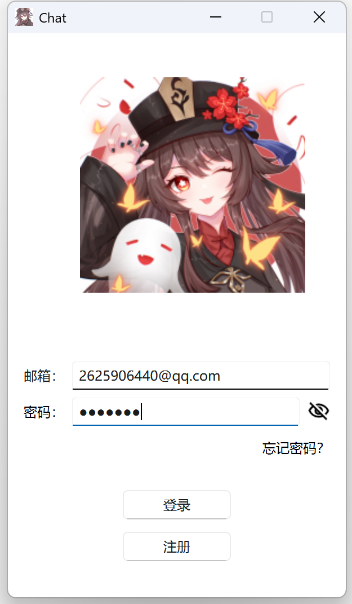
    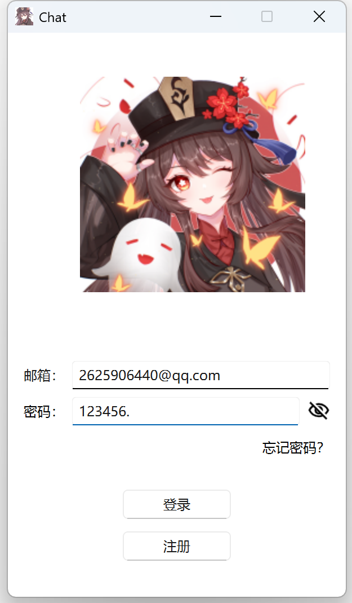
    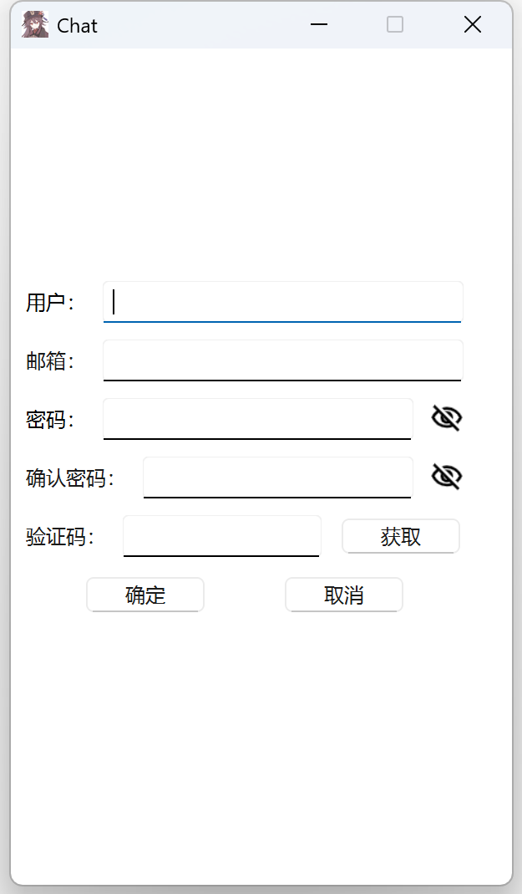
    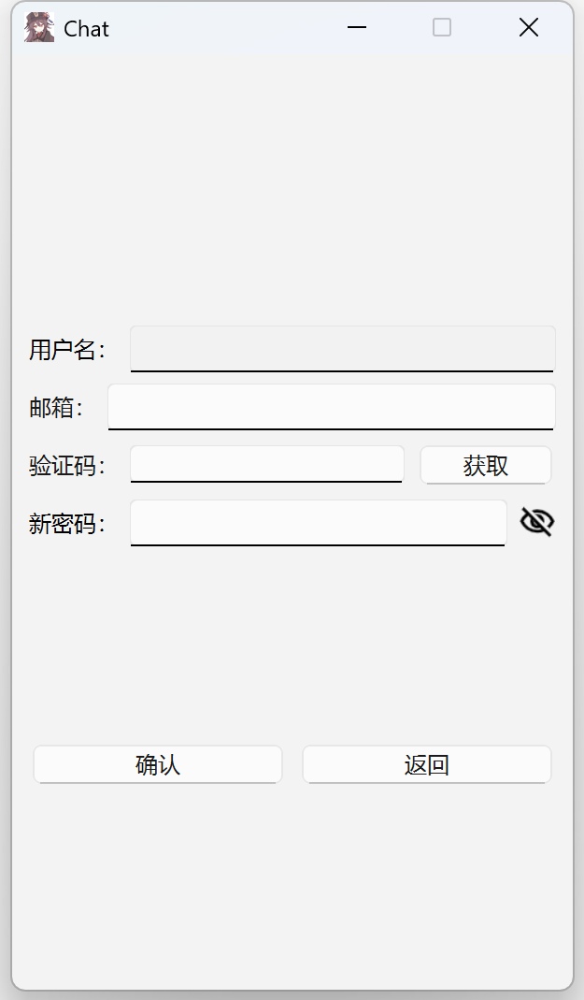

## 聊天界面

用户点击登录按钮后进入聊天界面，此时后端会根据服务器的负载将用户登录到连接数比较少的服务器上。

聊天界面展示：

    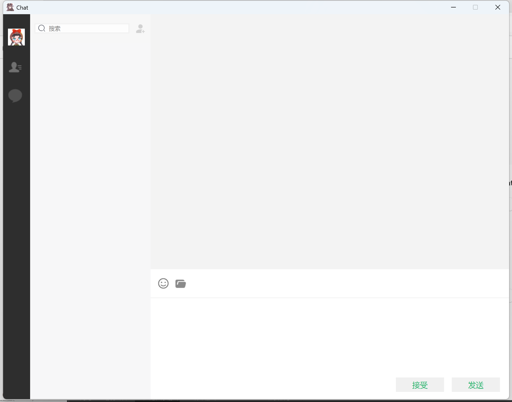
    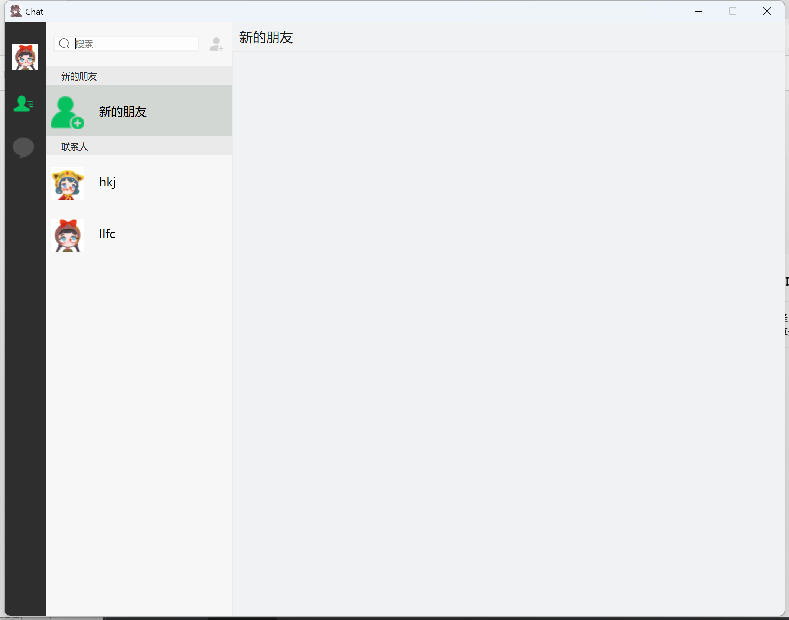
    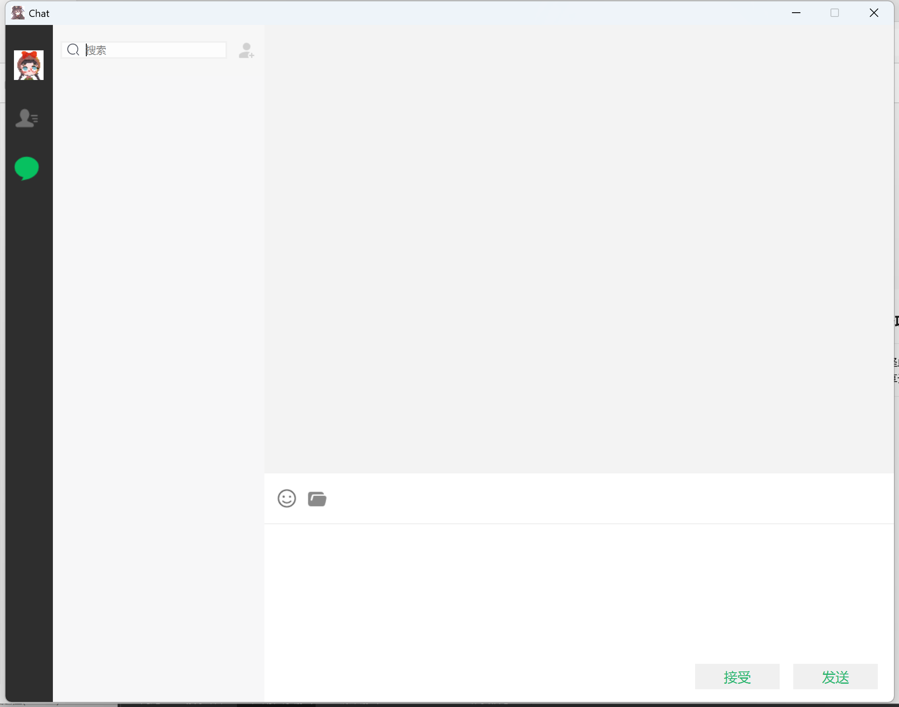

多用户登录时服务器日志展示：

    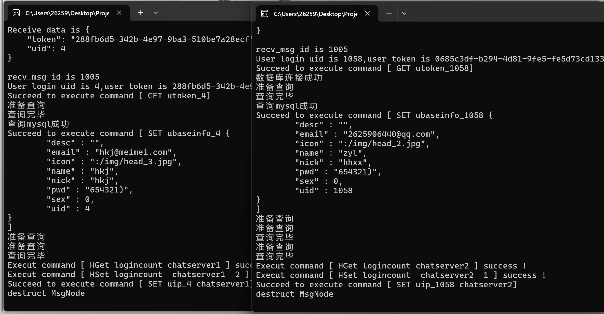

## 添加好友功能

在搜索栏中搜索好友用户名，搜到后弹出添加好友用户界面：

    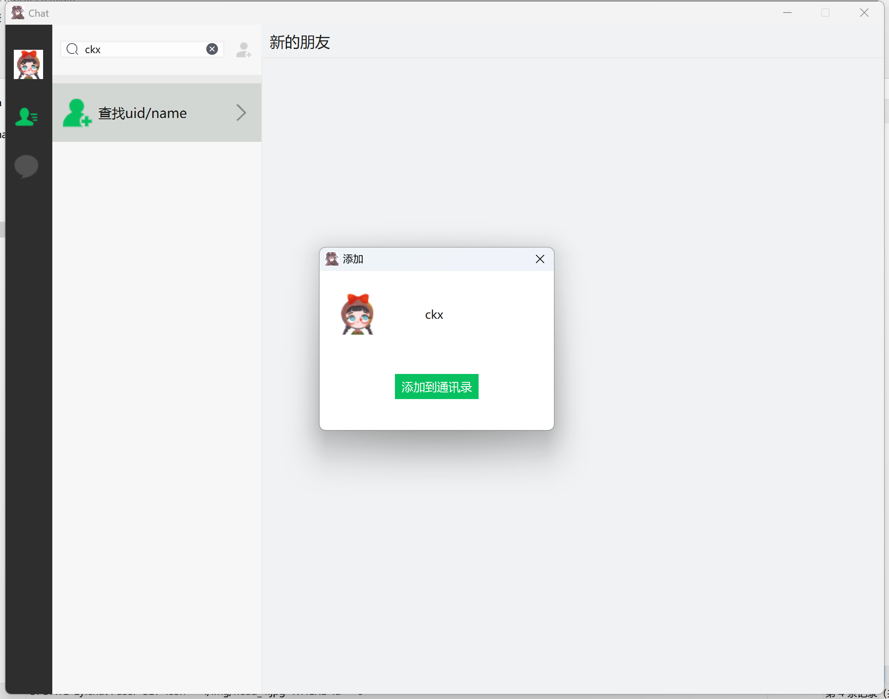
    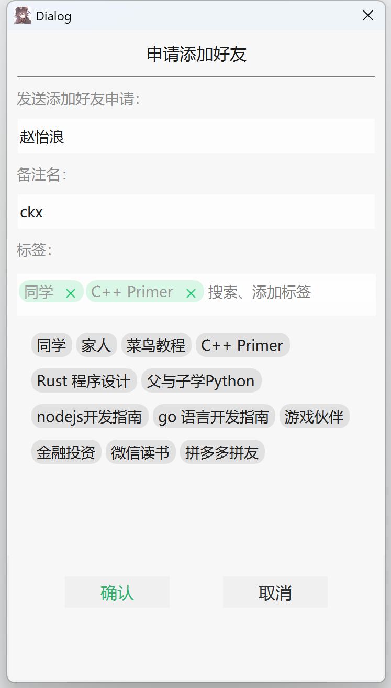

用户登陆后自动加载申请列表，同意后联系人列表显示对方相关信息：

    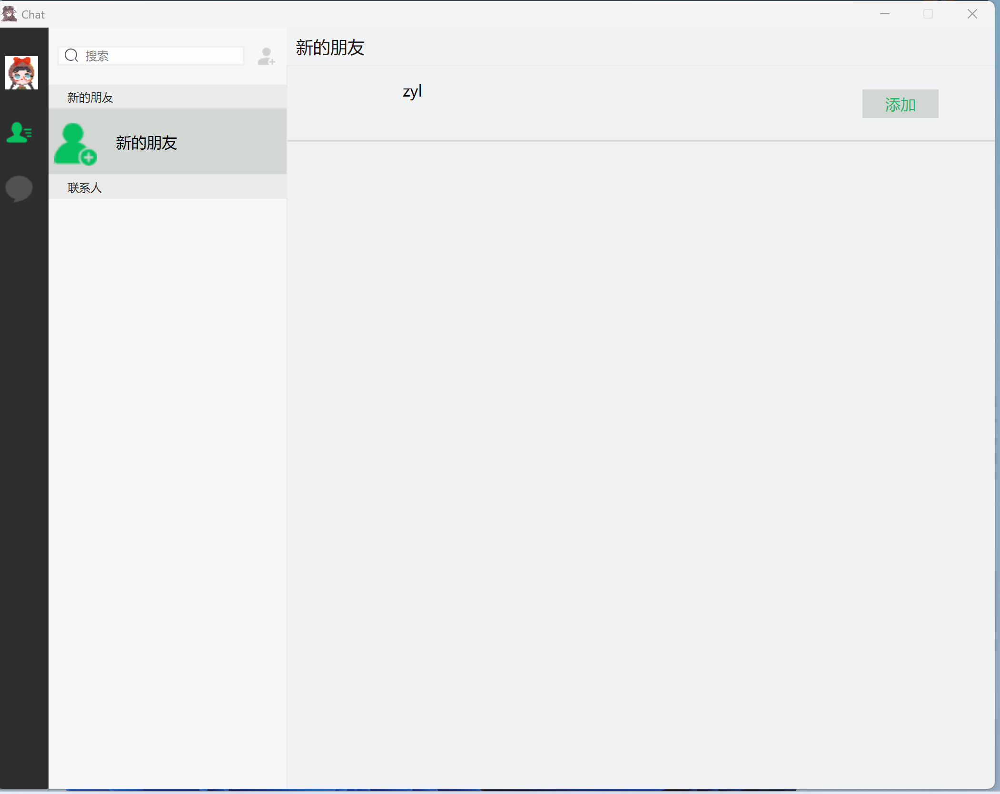
    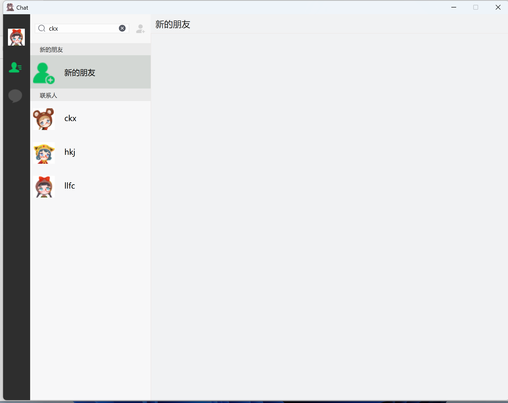
    

## 聊天功能

支持文本消息发送

    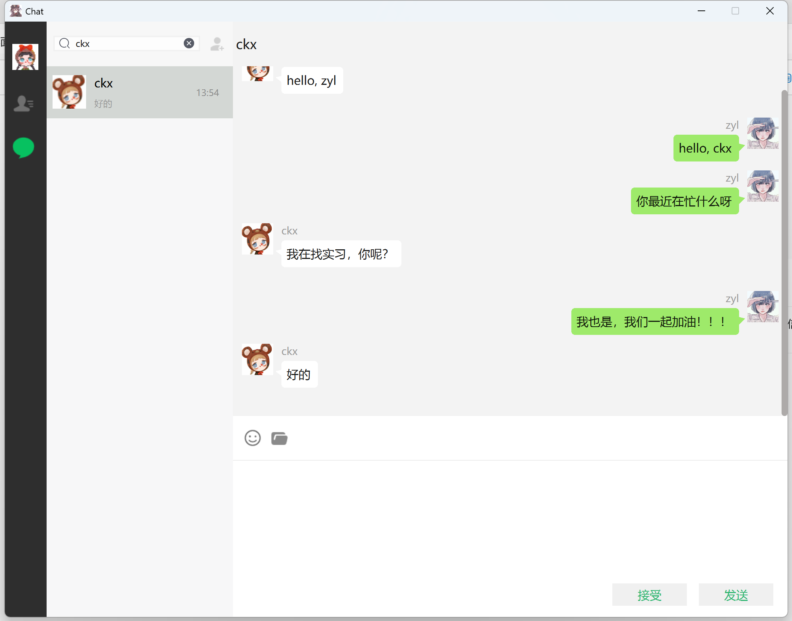
    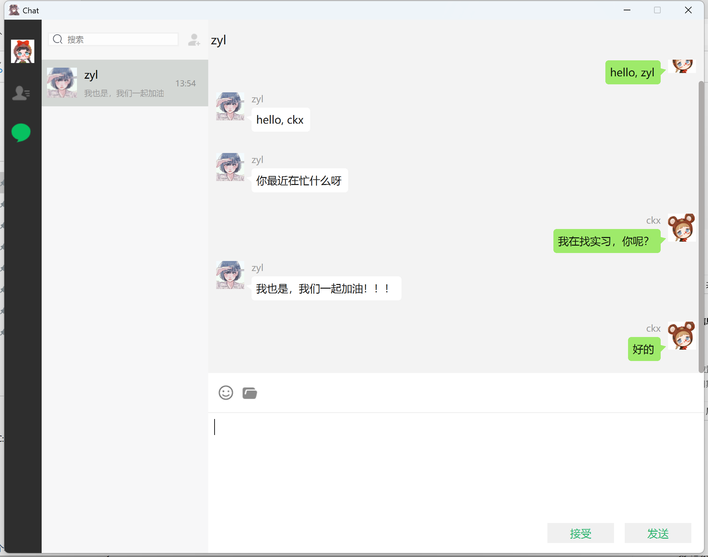

